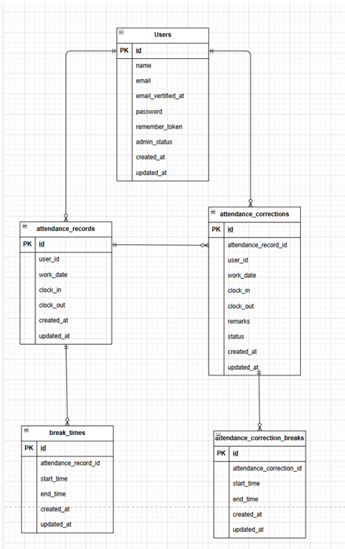

# Time Tracking App

## アプリ概要

勤怠管理アプリです。

一般ユーザーは出勤・退勤・休憩・勤怠修正申請を行うことができます。
管理者は全ユーザーの勤怠確認、スタッフ別勤怠一覧の確認、修正申請の承認を行うことができます。

---

## 主な機能

### 一般ユーザー

- 会員登録
- ログイン / ログアウト
- 出勤
- 退勤
- 休憩開始 / 終了
- 勤怠一覧表示
- 勤怠詳細表示
- 勤怠修正申請
- 修正申請一覧表示

### 管理者

- ログイン
- 日別勤怠一覧表示
- スタッフ一覧表示
- スタッフ別勤怠一覧表示
- 修正申請一覧表示
- 修正申請承認

---

# 使用技術（実行環境）

- PHP 8.1
- Laravel 8.x
- MySQL 8.0
- nginx
- Docker
- Docker Compose

---

# 環境構築

## Docker

- git clone git@github.com:Aya-Kawa/time-tracking-app.git
- cd flea_market_test
- docker-compose up -d --build

---

## Laravel環境構築

- docker-compose exec php bash
- composer install
- cp .env.example .env
- php artisan key:generate
- php artisan migrate
- php artisan db:seed
- php artisan storage:link
  ※ .env は必要に応じて DB 設定を調整してください。

---

##　メール認証について
本アプリでは会員登録後、メール認証が必要です。開発環境ではMailtrapを使用しています。
認証メールは実際のメールアドレスには送信されず、Mailtrap上で確認できます。

## メール認証設定

\*Mailtrapのアカウント作成およびSMTP情報の取得が必要です。
'.env'に以下を設定してください

```env
MAIL_MAILER=smtp
MAIL_HOST=sandbox.smtp.mailtrap.io
MAIL_PORT=2525
MAIL_USERNAME=××××××××××
MAIL_PASSWORD=××××××××××
MAIL_ENCRYPTION=null
MAIL_FROM_ADDRESS=test@gmail.com
MAIL_FROM_NAME="Laravel Test"
```

## テスト環境

テスト用データベースを作成し、`.env.testing`を作成してください。

```bash
cp .env.example .env.testing
```

`.env.testing` のデータベース接続情報を以下のように設定してください。

```env
DB_CONNECTION=mysql_test
DB_HOST=mysql
DB_PORT=3306
DB_DATABASE=demo_test
DB_USERNAME=root
DB_PASSWORD=root
```

その後、以下を実行してください。

```bash
php artisan key:generate --env=testing
php artisan migrate --env=testing
php artisan test
```

---

# 開発環境

| 内容                 | URL                          |
| -------------------- | ---------------------------- |
| 一般ユーザーログイン | http://localhost/login       |
| 一般ユーザー会員登録 | http://localhost/register    |
| 勤怠画面             | http://localhost/attendance  |
| 管理者ログイン       | http://localhost/admin/login |

---

# データベース

## ER図

## 
